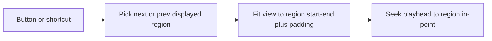

# Marker in/out navigation

Cycle through **marked regions** (the silence/Mark intervals with in/out edges), not the transport IN/OUT loop pair. Each step zooms the waveform so that region's displayed start–end fills the viewport, then seeks the playhead to the region's in-point.

## Behavior

- Targets `editor.silenceRegions` with a non-null `displayed` interval (same list as the "N regions" count).
- **Next:** first region whose `start` is after the playhead; wrap to the first region.
- **Prev:** last region whose `start` is before the playhead; wrap to the last region.
- **Fit:** `setView` so `[displayed.start, displayed.end]` is fully visible, with ~10% padding on each side so the in/out ticks aren't flush with the canvas edge. Clamp with existing `setView` rules and a 0.2s minimum (same floor as wheel zoom in [`Waveform.svelte`](src/lib/components/Waveform.svelte)).
- **Seek:** `player.seek(region.start)` so Play starts at that marker; if audio is already playing, seek keeps it playing (existing `AudioPlayer.seek` behavior).
- No regions: buttons disabled, shortcuts no-op.

## Where the logic lives

Pure pick + fit math in a new module [`src/lib/audio/markerNav.ts`](src/lib/audio/markerNav.ts) (same pattern as [`silence.ts`](src/lib/audio/silence.ts) / [`timelineMap.ts`](src/lib/audio/timelineMap.ts)):

- `adjacentMarkedRegion(intervals, fromSec, direction) => { start, end } | null`
- `viewWindowForInterval(start, end, keptDuration) => { start, duration }`

[`EditorState`](src/lib/editor.svelte.ts) gets one method, e.g. `goToAdjacentMarkedRegion("next" | "prev"): { start: number } | null`, that:

1. Reads `markedIntervals`
2. Picks the neighbor from `playheadSec`
3. Calls `setView` with the fitted window
4. Returns the in-point for the caller to seek

Editor still does not import the player (player already depends on editor).

Tests in [`src/lib/audio/markerNav.test.ts`](src/lib/audio/markerNav.test.ts): wraparound, playhead inside a region, empty list, padding + min duration + clamp to file length.

## UI

Prev/next buttons in [`SilenceControls.svelte`](src/lib/components/SilenceControls.svelte), next to the existing region count:

`◀ [`  `3 / 12`  `] ▶`

Show the current index after a jump (1-based among displayed regions). Before the first jump, keep `N regions` with no index, or show `– / N`.

Disable both buttons when there is no audio or `markerCount === 0`.

## Keyboard

Extend `onKeydown` in [`+page.svelte`](src/routes/+page.svelte), skipping form fields like Space/`m`:

- `[` → previous
- `]` → next

Call `editor.goToAdjacentMarkedRegion(...)` then `player.seek(start)` when it returns a region.

These keys are unused today (Space, Esc, `m` only).
