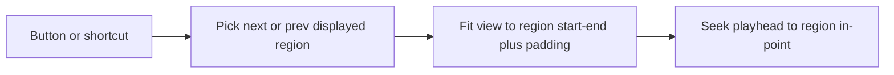

# Marker in/out navigation

Cycle through **marked regions** (the silence/Mark intervals with in/out edges), not the transport IN/OUT loop pair. Each step zooms the waveform so that region's displayed start–end fills the viewport, then seeks the playhead to the region's in-point.

## Behavior

- Targets `editor.markedIntervals` (the displayed marker bounds — same list as the "N regions" count), sorted by `start` since storage order isn't guaranteed.
- **Current position** is derived from the playhead every press, not from stored index (an index would go stale across Detect/undo/manual seeks):
  - If the playhead is inside a region's `[start, end)`, that region is "current" and next/prev step ±1 through the sorted list, wrapping.
  - Otherwise the playhead is in a gap: **next** is the first region with `start` after the playhead (wrap to the first); **prev** is the last region with `end` at or before the playhead (wrap to the last).
  - Containment-first matters for **prev**: comparing only against `start` breaks the moment the playhead ticks even slightly past a region's exact start (immediately on Play, or a mid-region click) — `prev` would then match the *same* region again instead of the one before it.
- **View filter:** force `viewFilter` to `"all"` as part of the jump, before fitting. `setView` works in *kept* seconds — under `hideMarked` the target region is collapsed to zero width (nothing to fit), and under `hideUnmarked` the padding would pull in neighboring kept content unrelated to this region in source time. `muteMarked` is untouched (playback-only, doesn't affect what's visible). Bundled into the same undo step as the fit + seek so Cmd+Z reverts the whole jump together.
- **Fit:** `setView` so `[displayed.start, displayed.end]` is fully visible, with ~10% padding on each side so the in/out ticks aren't flush with the canvas edge. Clamp with existing `setView` rules and a 0.2s minimum (same floor as wheel zoom in [`Waveform.svelte`](src/lib/components/Waveform.svelte)).
- **Seek:** `player.seek(region.start)` so Play starts at that marker; if audio is already playing, seek keeps it playing (existing `AudioPlayer.seek` behavior).
- No regions: buttons disabled, shortcuts no-op.

## Where the logic lives

Pure pick + fit math in a new module [`src/lib/audio/markerNav.ts`](src/lib/audio/markerNav.ts) (same pattern as [`silence.ts`](src/lib/audio/silence.ts) / [`timelineMap.ts`](src/lib/audio/timelineMap.ts)):

- `adjacentMarkedRegion(intervals, playheadSec, direction) => DisplayedInterval | null` — sorts, does the containment-first pick above
- `fitWindow(interval, totalDurationSec) => { startSec, durationSec }` — padding + 0.2s floor + clamp to file length

[`EditorState.goToAdjacentMarkedRegion(direction)`](src/lib/editor.svelte.ts) then:

1. Reads `markedIntervals`, picks the neighbor from `playheadSec` via `adjacentMarkedRegion`
2. In one `commitEdit`: sets `viewFilter = "all"`, then `setView` with the fitted window
3. Returns the region's `start` (the in-point) for the caller to seek, or `null` if there are no regions

Editor still does not import the player (player already depends on editor). The seek itself — and wrapping the view-filter reset + fit + playhead move into *one* undo step — is orchestrated by a new `player.goToAdjacentMarkedRegion(direction)` (mirrors the existing `beginEdit`/`endEdit`-around-the-gesture pattern used for waveform click-seeks), so both the keyboard handler and the toolbar buttons call one thing.

Tests in [`src/lib/audio/markerNav.test.ts`](src/lib/audio/markerNav.test.ts): wraparound, playhead inside a region (including near its far edge, to cover the prev-gets-stuck case), playhead in a gap, empty list, padding + min duration + clamp to file length.

## UI

Prev/next buttons in [`SilenceControls.svelte`](src/lib/components/SilenceControls.svelte), next to the existing region count:

`◀ [`  `3 / 12`  `] ▶`

Show the current index after a jump (1-based among displayed regions). Before the first jump, keep `N regions` with no index, or show `– / N`.

Disable both buttons when there is no audio or `markerCount === 0`.

## Keyboard

Extend `onKeydown` in [`+page.svelte`](src/routes/+page.svelte), skipping form fields like Space/`m`:

- `[` → previous
- `]` → next

Both call `player.goToAdjacentMarkedRegion(...)`.

These keys are unused today (Space, Esc, `m` only).
