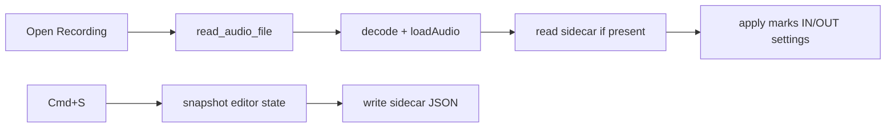

# Save markers as an audio sidecar

Edits in this app are already non-destructive metadata (`rawSilenceRegions`, IN/OUT, settings) sitting on [`EditorState`](src/lib/editor.svelte.ts). Persistence is a sidecar next to the audio — not a rewrite of the recording.

**Example:** open `/Takes/interview.wav` → Cmd+S writes `/Takes/interview.hre.json` → opening that wav again loads the sidecar if it exists.



## Sidecar format

New pure module [`src/lib/projectFile.ts`](src/lib/projectFile.ts) (no Tauri, no `EditorState`) owns path derivation and JSON:

- Path: same directory + same stem + `.hre.json` (so `interview.wav` does not collide with an unrelated `interview.json`)
- Payload:

```ts
{
  version: 1,
  audioFileName: string,
  durationSec: number,          // sanity check on reload
  rawSilenceRegions: { start, end }[],
  inSec: number,
  outSec: number,
  settings: { positiveSpeechThreshold, minSilenceMs, bufferMs }
}
```

- `parseProjectFile(json)` validates version/shape, drops invalid regions, returns `null` on garbage rather than throwing
- Tests in [`src/lib/projectFile.test.ts`](src/lib/projectFile.test.ts) covering round-trip, sidecar path, and invalid JSON

This stays a **deep module**: page/editor call `sidecarPath` / `serialize` / `parse`; they do not know about JSON field names.

## Tauri I/O

Match the existing `read_audio_file` pattern in [`src-tauri/src/lib.rs`](src-tauri/src/lib.rs) — no fs plugin needed:

- `read_text_file(path)` → `Ok(None)` if missing, `Ok(Some(text))` otherwise
- `write_text_file(path, contents)` → overwrite the sidecar

Register both in `generate_handler!`. Capabilities stay as they are (app commands, not plugin scopes).

## Editor session

[`EditorState`](src/lib/editor.svelte.ts):

- Store `filePath` (full path) alongside `fileName` so save has a destination without a dialog
- `loadAudio(...)` still resets marks; the page then applies a parsed project if one exists
- `applyProject(project)` restores regions, IN/OUT (clamped to duration), and settings
- `toProject()` snapshots the persistable fields

## Open + Save in the UI

[`src/routes/+page.svelte`](src/routes/+page.svelte):

- Keep the full `selected` path (today only the basename is kept)
- After `loadAudio`, `invoke("read_text_file")` on the sidecar path; if present and valid, `applyProject`
- **Cmd+S / Ctrl+S** (and a toolbar **Save** button next to Open) write the sidecar; no save-as dialog
- Skip save when no file is open; show a short status (`Saved` / error) in the existing toolbar
- Ignore the shortcut only when it would fight the browser (always `preventDefault` on S+meta/ctrl)

Missing sidecar is normal — open still succeeds with empty marks.

## Duration mismatch

If the sidecar's `durationSec` disagrees with the decoded buffer (re-exported / truncated take), clamp IN/OUT and drop regions that fall entirely past the new end rather than refusing to load. That keeps marks useful when a file is slightly re-encoded.
