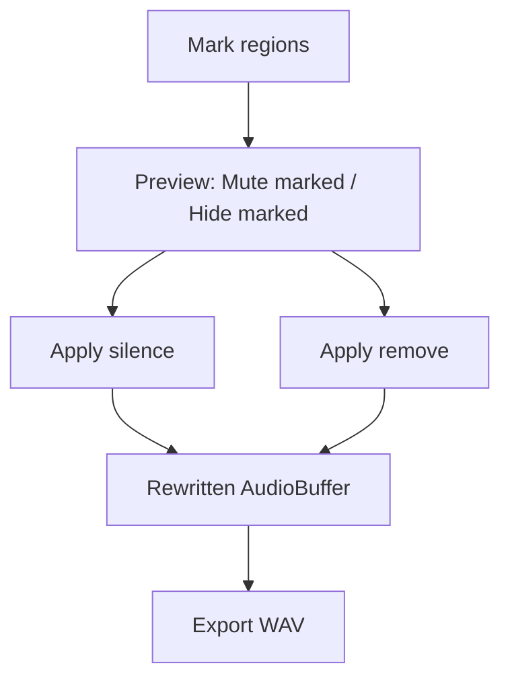

# Silence, remove, and export marked regions

## How this sits on uncommitted work

The working tree already has the **region view filter + mute preview** (uncommitted, not in `main`):

- Untracked: [`timelineMap.ts`](src/lib/audio/timelineMap.ts), [`playbackPlan.ts`](src/lib/audio/playbackPlan.ts) and their tests
- Modified: [`editor.svelte.ts`](src/lib/editor.svelte.ts) (`viewFilter`, `muteMarked`, `timelineSpans`), [`player.ts`](src/lib/player.ts) (schedules `playbackPlan`), [`Waveform.svelte`](src/lib/components/Waveform.svelte) (kept-time + gutters), [`SilenceControls.svelte`](src/lib/components/SilenceControls.svelte) (All / Hide marked / Hide unmarked + Mute marked), [`theme.ts`](src/lib/theme.ts)

That layer is **preview only**. The `AudioBuffer` is unchanged. Mute ducks via a `GainNode`; Hide marked skips chunks on playback and collapses the waveform. **Exporting today would still write the original take**, even with mute/hide on.

This plan **keeps that work and layers apply + export on top**. Do not revert or re-implement gutters / `playbackPlan`. `+page.svelte` and `src-tauri/` are untouched in the current diff, so Export lands there with no merge fight.

Preview vs apply (same displayed ticks, same 100ms fades):

- **Mute marked** (preview) maps to **Apply silence** (zeros PCM, duration stays)
- **Hide marked** (preview) maps to **Apply remove** (concatenates keep spans, duration shortens)
- After apply: clear regions, reset `viewFilter` to `"all"` and `muteMarked` to false (same as `loadAudio`). Preview controls go quiet until you mark again.
- **Gotcha:** Export writes the buffer, not the current preview. Hide marked without applying remove still exports the full original.

UI labels must not collide with the existing Mute / Hide buttons. Use **Apply silence** / **Apply remove** (destructive) vs **Mute marked** / **Hide marked** (reversible).

Use the **displayed** ticks, not the raw VAD hatch. Reuse `visibleSpans(..., "hideMarked")` and import `MUTE_FADE_SEC` from [`playbackPlan.ts`](src/lib/audio/playbackPlan.ts) so apply fades match what you already hear.

## Apply math — [`src/lib/audio/applyEdits.ts`](src/lib/audio/applyEdits.ts) (new)

Deep module: `Float32Array[]` in, new `Float32Array[]` out. No `AudioBuffer`, no Tauri. Tests in `applyEdits.test.ts`.

- `silenceMarked(channels, sampleRate, marked)` — same length; zero each hidden span. **100ms linear fades** inside each marked edge (fade duration = half the region if shorter than 200ms) so splices don’t click. Speech outside the ticks is unchanged.
- `removeMarked(channels, sampleRate, marked)` — concatenate `keep` spans. Same 100ms fade-out at the end of a keep and fade-in at the start of the next (no overlap, slightly eats speech at the join). Reject a no-keep result (whole file marked) instead of writing an empty buffer.
- Fade length is `MUTE_FADE_SEC` (0.1) from `playbackPlan.ts`, not a second constant.

Per-channel, so stereo stays stereo. Editor then wraps the result in a new `AudioBuffer` via `player.getContext()`.

## Editor — [`src/lib/editor.svelte.ts`](src/lib/editor.svelte.ts)

New `replaceAudio(buffer, monoSamples)`: swap the take, recompute duration, **clear `rawSilenceRegions`**, reset playhead / IN / OUT / view / `viewFilter` / `muteMarked` (same reset as `loadAudio`), keep `fileName`. Pause via `player.pause()` first so the scheduled plan is torn down before the buffer disappears.

`applySilenceMarked()` / `applyRemoveMarked()`:
1. Collect displayed intervals from `silenceRegions`.
2. Copy each channel with `getChannelData(i).slice()` (never mutate the live buffer in place).
3. Run the apply function, build a new `AudioBuffer`, `mixToMono`, `replaceAudio`.

Disabled when there is no audio or no displayed region.

No undo copy (an hour-long stereo take is already ~1 GB in RAM). Re-open the original file to revert. A `confirm()` before apply is enough.

## Encode + write

**[`src/lib/audio/encodeWav.ts`](src/lib/audio/encodeWav.ts)** — 16-bit PCM WAV, original sample rate and channel count, interleaved little-endian. Tests with a tiny known buffer (header size, sample rate field, a couple of PCM values).

**[`src-tauri/src/lib.rs`](src-tauri/src/lib.rs)** — `write_audio_file` mirroring `read_audio_file`: path comes from the save dialog (user-authorized, same trust model as open). For the payload, use `@tauri-apps/plugin-fs` `writeFile` so a long recording is not JSON-serialized as a number array (the reason read already uses `ipc::Response`). Add the plugin in Cargo.toml / `lib.rs` / capabilities with write/create on the user-chosen path. If plugin-fs scoping is awkward for an arbitrary save location, a custom command taking `Vec<u8>` is the fallback — but only if we can send raw bytes, not a JSON array.

## UI

- [`SilenceControls.svelte`](src/lib/components/SilenceControls.svelte): **Apply silence** and **Apply remove** next to the existing Mute / View controls. Disabled without audio or displayed regions. Leave the preview segmented control and mute toggle as they are.
- [`+page.svelte`](src/routes/+page.svelte): **Export** next to Open Recording (this file is clean in the current diff). `save()` dialog, default name `{stem}.wav`. Encode current `audioBuffer`, write, surface errors like open already does. Disabled without audio.

## Tests (seams)

- `applyEdits`: silence zeros a marked middle and preserves length; fades land at edges; remove concatenates keep spans and shortens duration; overlapping marks merge via `visibleSpans`; all-marked remove is a documented error.
- `encodeWav`: RIFF/WAVE/fmt/data, sample rate, 16-bit stereo interleave on a 2–4 sample fixture.

Not tested: dialog, fs, Svelte buttons.

## Out of scope

- IN–OUT trim on export
- Per-region mix of silence vs remove
- Re-encoding mp3/m4a
- Reworking or replacing the uncommitted preview layer
- Changing unused [`src/lib/player.svelte.ts`](src/lib/player.svelte.ts)
