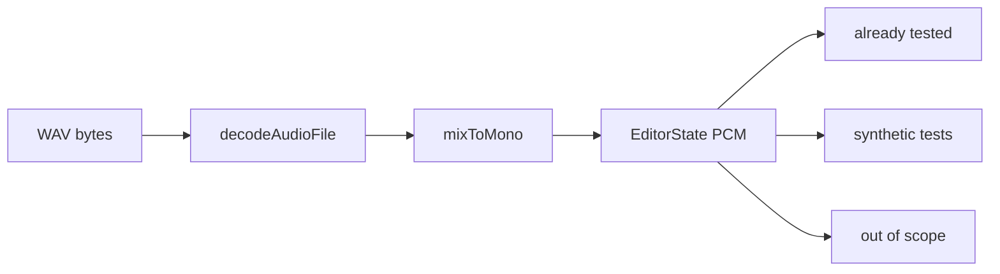

# Test the WAV at the decode seam

The file is 16-bit PCM, mono, 44.1 kHz, 694232 frames (~15.74s). Existing tests ([`silence.test.ts`](src/lib/audio/silence.test.ts), [`timelineMap.test.ts`](src/lib/audio/timelineMap.test.ts), [`playbackPlan.test.ts`](src/lib/audio/playbackPlan.test.ts), [`projectFile.test.ts`](src/lib/projectFile.test.ts)) already cover their modules with number literals. Feeding them a real take would make assertions slower and coupled to this recording’s contents.

The WAV uniquely helps one untested module: [`src/lib/audio/decode.ts`](src/lib/audio/decode.ts) — the bytes-to-samples path used on Open Recording.

## What we will not test with this file

- **Silence / timeline / playback plan** — already specified with exact times.
- **Peaks** — still untested, but a 4-sample ramp with known min/max is a better oracle than 15s of speech. Leave for a later slice.
- **VAD / worker** — this take does have speech and gaps, but Silero needs ONNX WASM, fetch of [`/vad-assets/`](src/lib/audio/vad.ts), and assertions on segment times that drift when the model bumps. Downstream gap math is already tested. A loose “finds some speech” smoke test is a later, tagged-slow slice after the asset path is injectable.
- **`encodeWav` round-trip** — that module is not built yet. When it lands, reuse the same fixture helper; do not add encode tests now.
- **Editor / player / Tauri open** — `loadAudio` takes an already-decoded buffer; dialogs and `AudioContext` playback are not Node-testable without a heavy polyfill.

## Fixture location

Move [`static/test_audio.wav`](static/test_audio.wav) to [`src/lib/audio/fixtures/test_audio.wav`](src/lib/audio/fixtures/test_audio.wav).

`static/` is copied into the Tauri webview. A 1.4 MB test take should not ship with the app, and Open Recording cannot pick a `static/` URL anyway (it uses a filesystem dialog).

Shared test helper next to it, e.g. [`src/lib/audio/fixtures/testWav.ts`](src/lib/audio/fixtures/testWav.ts) (imported only from tests):

- `readTestWavBytes(): Uint8Array` via `node:fs`
- A **PCM-WAV-only** `decodePcmWav(arrayBuffer) → AudioBuffer-like` used as the test `AudioContext` adapter (this file is format 1, 16-bit, mono). Not a production decoder — production still uses `decodeAudioData`.

Known literals for assertions (independent of the parser’s arithmetic): `sampleRate = 44100`, `numberOfChannels = 1`, `length = 694232`.

## Tests in [`src/lib/audio/decode.test.ts`](src/lib/audio/decode.test.ts)

Seam: `decodeAudioFile` and `mixToMono` only.

**Glue (fake `decodeAudioData`, no WAV needed — these protect the comments in `decode.ts`):**

- Whole-buffer `Uint8Array` → `decodeAudioData` receives the same `ArrayBuffer` (no copy).
- Narrow view (`byteOffset !== 0`) → decoder receives a copy, original backing buffer stays usable.
- `mixToMono` on a 1-channel stub returns a **copy** (not `getChannelData(0)`), so a later transfer cannot detach the buffer.
- `mixToMono` on a 2-channel stub averages channels. The fixture is mono, so this branch stays synthetic.

**Fixture smoke (WAV bytes + the PCM adapter):**

- `decodeAudioFile(readTestWavBytes(), adapter)` yields 44100 Hz, 1 channel, length 694232.
- `mixToMono` of that buffer has the same length, is a distinct array, and has audible energy (e.g. some `|sample| > 0.1` — this take clips around 7–8s).

No `node-web-audio-api` / happy-dom. Vitest stays `environment: "node"`.

## Small interface shrink (optional, same slice)

Narrow `decodeAudioFile`’s second argument from `AudioContext` to `{ decodeAudioData(arrayBuffer: ArrayBuffer): Promise<AudioBuffer> }`. `player.getContext()` already satisfies that. Tests then pass the PCM adapter without a cast, and the production type no longer pretends decode needs a full context.

## Out of scope

Peaks tests, VAD, encode/export, moving the fixture into git-LFS, serving it from the running app.
