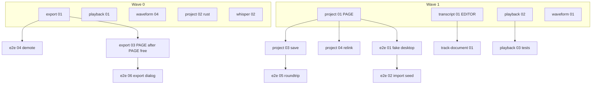

# Delivery plan — orchestrator

This file is the runbook for the parent agent. Workers never implement from this file; they get one ticket + `WORKER.md` + that area’s `TDD.md`.

**Default branch:** `main` (`origin/main`).
**One ticket = one branch = one PR.**
**Do not push or open PRs until the user asks.** Plan the branches anyway so workers can name them.

## Goal

Tighten the editor from “works” to modular, TDD-backed coverage without a wide rewrite. Depth stays at existing audio math. New depth is the desktop session (open/save/export) and tests at those seams.

## Roles

| Role | Does | Does not |
|------|------|----------|
| **Orchestrator** (this chat / parent) | Pick the frontier, assign at most one worker per hotspot, rebase stacked work, merge order, update ticket Status | Write production code for a ticket |
| **Worker** | One ticket, TDD, green suite, stop | Touch other tickets, refactor beyond the slice, open follow-up scope |
| **Reviewer** (after green) | code-review skill: coupling, leftover comments, extra API | Redesign the slice |

Dispatch: `Task` explore is for reading; implementation workers are `generalPurpose` with `WORKER.md` pasted and the ticket path. `run_in_background: true` only when two workers have **disjoint hotspots**.

## Branching

```
main
 ├─ tdd/project-session/01-import-recording-companion-project
 ├─ tdd/project-session/02-atomic-project-writes          (parallel: rust-only)
 ├─ tdd/export-session/01-edited-render-matches-preview   (parallel: audio tests)
 ├─ tdd/playback/01-remove-unused-single-track-player     (parallel: delete orphan)
 └─ …stacked only when Blocked by is real
      tdd/project-session/03-first-save-…  (base = 01 after merge or stack on 01)
```

- Name: `tdd/<area>/<NN>-<slug>` matching the issue filename without `.md`.
- **Independent off `main`** when Blocked by is None **and** hotspot is free.
- **Stack** when Blocked by names a ticket in the same area, or the worker must see the predecessor’s module.
- Rebase onto `main` after the blocking PR merges. No force-push to `main`. No `--no-verify`.
- Integration branch only if two mutex lanes must meet before e2e 05/06: `tdd/integrate/desktop-seam` branched from `main` after project 01 and export 03 merge.

## Hotspot mutex (one in-flight PR each)

Workers collide if they share a file. Orchestrator grants the lock.

| Mutex | Typical files | Lanes that take it |
|-------|----------------|--------------------|
| `PAGE` | page shell, file menu wiring | project-session (not 02), export-session 03–05, e2e 01 |
| `EDITOR` | session module | transcript, track-document, vad 02–03, waveform 02–03 |
| `PLAYER` | playback module | playback 02–05 |
| `WAVEFORM` | waveform / track lane | waveform 01, 05 |
| `E2E` | Playwright spec | e2e 02–06 |
| `RUST_IO` | native text/audio write | project 02, export 04 |
| `RUST_WHISPER` | native transcription | whisper 01–04 |
| `AUDIO_MATH` | apply-edits / export mix | export 01–02 |

`FREE` (no mutex): playback 01 (delete unused file), waveform 04 (layout tests), vad 01 if it only adds a helper and two one-line call sites — still serialize vad 01 after EDITOR is quiet.

## Locked product decisions

Workers treat these as given. Do not re-open in the ticket.

1. **Open Project is current-format only.** Legacy companions restore by importing the recording beside them. Ticket project-session 06 locks that with a test + README sentence.
2. **Mismatched sample rates: refuse export** with the existing convert-and-reopen message. No resampling in this program. Ticket export-session 05 is a characterization test.
3. **Transcripts are not undoable.** Completing transcribe marks the project dirty so Save persists words. Undo does not revert a transcript. Ticket transcript-session 04 locks that.
4. **Select-drag stays pending.** Mark / Unmark / Cut are explicit. Align comments with `finishSelectionDrag`. Ticket waveform-gestures 02.
5. **Apply project positionally; extra saved tracks are ignored, never applied to the wrong recording.** Identity mismatch still drops transcript. Ticket track-document 03.

## Waves

Merge a wave before starting work that lists those tickets as blockers. Inside a wave, only one holder per mutex.

### Wave 0 — characterization / delete (parallel)

| Ticket | Mutex | Why first |
|--------|-------|-----------|
| export-session 01 | AUDIO_MATH | First red is preview/export literals; unblocks e2e 04 |
| playback 01 | FREE | Delete unused player |
| waveform 04 | FREE | Layout tests, no UI rewrite |
| whisper 02 | RUST_WHISPER | Invalid WAV; no page |
| project-session 02 | RUST_IO | Atomic write; no page |

### Wave 1 — new seams (parallel after Wave 0 starts, disjoint mutex)

| Ticket | Mutex |
|--------|-------|
| project-session 01 | PAGE |
| transcript-session 01 | EDITOR |
| playback 02 | PLAYER (after 01 merges) |
| waveform 01 | WAVEFORM |
| vad-options 01 | EDITOR **after** transcript 01 merges — do not overlap |
| whisper 01 | RUST_WHISPER after 02, or parallel if 02 already merged |

### Wave 2 — consume the seams

- project-session 03, 04, 05 (PAGE, serial, base = 01)
- export-session 02 (AUDIO_MATH), then 03 (PAGE **after** project 03 or stack: export 03 needs PAGE)
- e2e 04 once export 01 is on `main` (moves Playwright parity into unit suite)
- playback 03 → 04 → 05
- transcript 02, 03 (03 can start Wave 1 if EDITOR free; prefer after 01)
- track-document 01 (EDITOR after transcript 01)

### Wave 3 — e2e on the user seam

- e2e 01 (PAGE) after project 01
- e2e 02, 03 (E2E)
- e2e 05 after project 03+04 and e2e 02
- e2e 06 after export 03 and e2e 02

### Wave 4 — polish / optional

- project 06, export 05, vad 02–04, waveform 02–03–05, track-document 02–04, transcript 04–05, whisper 03–04 (03–04 optional)



## Orchestrator loop (every dispatch)

1. Read ticket Status. Skip `done`. Skip if any Blocked by is not `done`.
2. Check mutex: if another in-flight branch holds it, wait.
3. Open worker with: ticket path, `.scratch/WORKER.md`, `.scratch/<area>/TDD.md` section for that NN, locked decisions above.
4. Worker completion criterion: named first-red test went red then green; all ticket ACs have tests; `npm test` and `npm run check` green; for rust tickets `cargo test --manifest-path src-tauri/Cargo.toml`; no extra files.
5. Orchestrator: mark ticket done, merge order, next frontier.
6. **Wave finish (always say this to the user).** After the last ticket in a wave is green, the parent message must end with **Manual test**. Never omit the heading. If nothing in the packaged app changed for a user, write `Manual test: none` and one line why (tests-only, dead-code delete, extract with the same branches). If something is listen/click/save/export visible, list numbered steps in the real Tauri window: starting state, action, what they should hear or see. Cover only what this wave could have broken. Do not dump a full regression script.

## Wave finish template

```
### Manual test
1. …
```

or

```
### Manual test
none — <one reason>
```

## What the orchestrator forbids

- Two workers on `PAGE` or `EDITOR` at once.
- A worker writing all tests for a ticket then all code (horizontal slice).
- E2e that `import()`s the session module (that is the regression e2e 02/03 remove).
- New TypeScript `interface` sprawl for a hypothetical second adapter. Second adapter exists when tests inject fakes: that is enough.

## Ticket completeness gate

A ticket is dispatchable only if `TDD.md` lists **Seam**, **First red**, **Prove red**, **Out of scope**. If a worker would have to invent the first test name, stop and patch `TDD.md` before dispatch.
